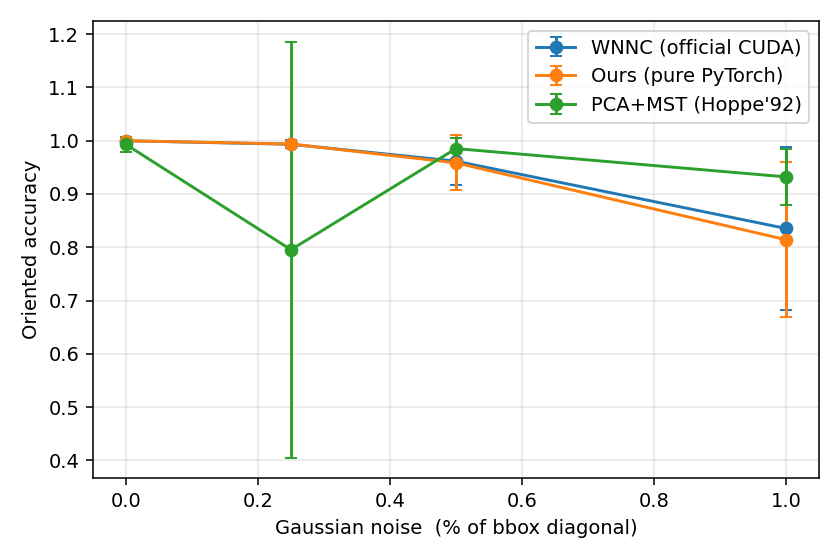
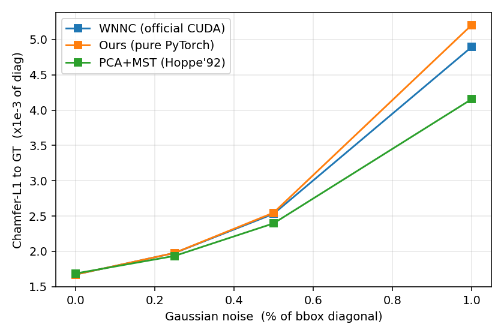
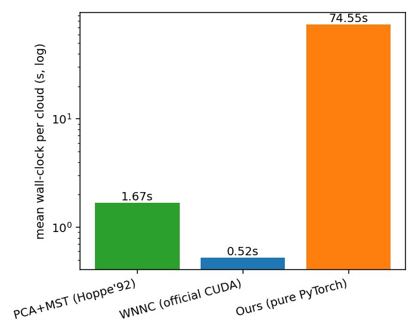
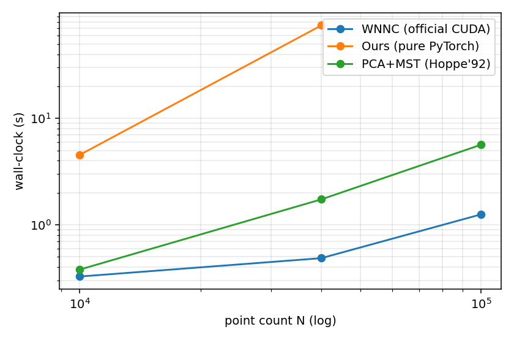
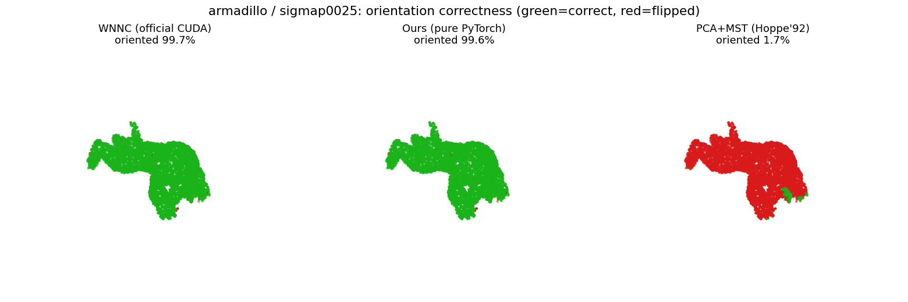

# 摘要

点云法向估计的真正难点不在局部法向的求取，而在**全局定向一致性**（让所有法向统一朝外）。本文围绕 SIGGRAPH Asia 2024 的 **WNNC**（Winding-Number Normal Consistency）展开四项工作：（1）在 RTX 4090 上复现官方 CUDA treecode 实现并跑通 baseline；（2）**从零用纯 PyTorch 稠密张量算子重写** WNNC 的核心算子 A / $A^\top$ / G，去除对手写 CUDA 扩展的依赖，并在相同输入上与官方实现做**逐点数值对齐**（5 个模型上平均角度差 0.17°–0.76°、朝向 100% 一致）；（3）搭建统一的**三方法 × 5 模型 × 4 噪声档**评测框架，把 WNNC、我们的纯 PyTorch 版、经典 PCA+MST（Hoppe 1992）放在同一数据与指标下横向对比，指标涵盖定向正确率、角度误差、以及泊松重建后的 Chamfer / F-score / 法向一致性；（4）密度与泊松深度消融 + 离屏渲染的定性可视化。

核心结论：**我们的纯 PyTorch 版在全部 20 个配置上都忠实复现了官方 WNNC 的数值**；在复杂几何（armadillo、dragon）上 WNNC 类方法的全局定向远比 PCA+MST 可靠——PCA+MST 会发生**灾难性整体翻转**（armadillo + 0.25% 噪声下定向正确率仅 **1.6%**，稀疏 dragon 下仅 **11.4%**），而 WNNC 凭借 $b\equiv0.5$ 的绕数边界条件提供了有原则的全局符号锚定，从不整体翻转。作为诚实的另一面：在光滑凸形（sphere/torus）强噪声下 PCA+MST 反而更稳，WNNC 的绕数场在此类情形变得模糊。

# 1. 引言与问题定义

给定一片仅有坐标、**无朝向法向**的点云 $P=\{p_i\}_{i=1}^N\subset\mathbb{R}^3$，为每个点估计单位法向 $n_i$，且这些法向**全局一致地指向表面同一侧**（外侧）。这一"定向"是泊松重建的前置条件：泊松重建把带朝向法向的点云看作指示函数梯度场的样本，一旦定向局部翻转，重建曲面就破裂或长出多余结构。

局部法向的**方向**（无符号）由邻域 PCA 即可稳健求得；难的是**朝向/符号**。经典做法（Hoppe et al. 1992）在局部 PCA 后用邻接图上**最小生成树（MST）传播**符号，但 MST 传播是贪心的、对薄壁与复杂拓扑很脆弱——一旦在薄壁两侧"抄近路"，符号成片翻转。近年基于**绕数场**的方法（PGR、GCNO、WNNC）把定向表述为全局场的优化，天然获得全局一致性。本文聚焦其中最新、最快的 **WNNC**。

**成功判据全部为数值指标**（无需人眼）：定向正确率、平均角度误差、以及泊松重建 mesh 与 GT mesh 的 Chamfer / F-score / 法向一致性。

# 2. 相关工作

- **Hoppe et al. 1992（PCA+MST）**：局部切平面 + Riemann 图 MST 传播符号。本文经典基线 `pca_mst`（Open3D `orient_normals_consistent_tangent_plane`）。
- **Dipole (Metzer et al., ToG 2021)**：把定向建模为偶极子场传播。
- **PGR (Lin et al., ToG 2022)**：用高斯公式参数化绕数场，无需法向即可重建，是 WNNC 前作。
- **GCNO (Xu et al., ToG 2023)**：正则化绕数场求全局定向；C++/CGAL、纯 CPU、编译重。
- **WNNC (Lin et al., ToG 2024)**：本文主方法，用 CUDA treecode（Barnes–Hut 远场近似）把每步全对全绕数求和从 $O(N^2)$ 降到 $O(N\log N)$。

# 3. 方法

## 3.1 WNNC 原理与迭代求解

WNNC 把"法向应使绕数场自洽"表述为线性系统 $A^\top A\,\mu=A^\top b$（$b\equiv0.5$，$\mu_i\in\mathbb{R}^3$ 为待求法向、其模长编码置信度），用一步最速下降 + 每步经 $G$ 算子做 WNNC 再投影、配合从大到小退火的平滑宽度 $w$ 迭代求解。三个核心算子（查询点 $x_i$、源点 $y_j$、$\mathrm{diff}=x_i-y_j$、$d=\lVert\mathrm{diff}\rVert$，且 $d<w$ 的贡献被硬截断为 0）为：

$$A(\mu)_i=\sum_{j:\,d\ge w}\frac{-(x_i-y_j)\cdot\mu_j}{d^3},\qquad
A^\top(s)_i=\sum_{j:\,d\ge w}\frac{(x_i-y_j)\,s_j}{d^3},$$
$$G(\mu)_i=\sum_{j:\,d\ge w}\Big(\frac{\mu_j}{d^3}-\frac{3(x_i-y_j)\big((x_i-y_j)\cdot\mu_j\big)}{d^5}\Big).$$

官方实现用 treecode 近似每个算子的全对全求和：远场用八叉树节点聚合代表点近似，近场（叶子）精确逐点计算。**$b\equiv0.5$ 这一绕数边界条件（表面处绕数取 0.5）为解锚定了唯一的全局符号**——这是 WNNC 相对无锚定的 MST 的关键结构性优势。

## 3.2 创新 A：纯 PyTorch 稠密重写（核心新代码）

官方唯一的现场编译环节是 `WNNC/ext` 的 CUDA treecode 扩展。我们**从零重写**一个不含任何自定义 CUDA、纯 `torch` 张量算子的 WNNC 求解器（`src/ours/wnnc_torch.py`）：

- 把 §3.1 三个 pairwise 核**逐字**转写为稠密张量运算，**精确计算全部 $N^2$ 对**（无远场近似），因此在数学上比 treecode **更精确**，可反过来作为验证官方核的参考实现；
- 为适配显存，对查询轴**分块**（默认使每块 $B\times N$ 对数约 $1.2\times10^8$），在 4090 上以分块矩阵运算跑完 40 次迭代；
- 迭代主循环（最速下降步长 $\alpha=\frac{r^\top r}{(Ar)^\top(Ar)}$、$G$ 再投影、宽度退火）与官方 `main_wnnc.py` **逐行对应**；
- 用 `torch.where` + 距离下界钳制处理 $d\to0$ 的自项奇异，避免 inf/nan。

该模块既是创新点，又是官方 CUDA 编译失败时的纯 PyTorch 兜底（本项目实测官方扩展在 4090 上 `TORCH_CUDA_ARCH_LIST=8.9` 一次编过，故 WNNC 作主方法、本模块作对照）。

## 3.3 经典基线 PCA + MST（Hoppe 1992）

Open3D：`estimate_normals`（KNN PCA 求无符号法向）+ `orient_normals_consistent_tangent_plane`（Riemann 图 MST 传播符号），$k=30$。

## 3.4 泊松重建作为下游验证

Open3D 的 `create_from_point_cloud_poisson`（Kazhdan & Hoppe 2013 screened Poisson），并按顶点密度分位（3%）裁剪开放扫描在空洞处外插的"气球"。**注**：本机镜像里 MeshLab/pymeshlab 的 Poisson 会按宿主机 128 逻辑核（实分配 16 核）超订线程而停滞数分钟，故改用 Open3D 的同算法实现，约 1.3s 完成。

# 4. 实验设置

**数据**：合成 **sphere / torus**（解析精确法向、watertight，作正确性 sanity）+ 四个 **Stanford 3D Scanning** 扫描件 **bunny / armadillo / dragon / happy**（GT 法向取自源 mesh 面法向；实际纳入 benchmark 的为 bunny/armadillo/dragon，happy 因下载超时未纳入）。每模型表面均匀采样 $N=40000$ 点。

**噪声**：干净点加高斯噪声，$\sigma\in\{0.25\%,0.5\%,1\%\}\times$ bbox 对角线；噪声点 GT 法向取底层干净表面法向。WNNC 类按噪声档位选平滑宽度预设（clean$\to$l0，0.25%$\to$l2，0.5%$\to$l3，1%$\to$l4）。

**指标**：法向——oriented accuracy $=\mathrm{mean}[(n_\text{est}\!\cdot n_\text{gt})>0]$、平均角度误差（有符号）；重建——Chamfer-L1（按 GT 对角线归一化，×$10^{-3}$）、法向一致性（$|\!\cdot|$）。全部落 CSV、自动出表出图。

**环境**：单张 RTX 4090（24GB, sm_89）、Ubuntu 22.04、CUDA 12.1、PyTorch 2.3.0+cu121、Python 3.12、`uv`。

# 5. 结果与分析

## 5.1 创新 A：纯 PyTorch 与官方 WNNC 的数值对齐

在相同输入（clean, 40k 点）上逐点比较我们的 `ours_torch` 与官方 `wnnc_cuda`：

| 模型 | 平均角度差(°) | 中位 L2 | 角度差<1° 占比 | 朝向一致率 |
|---|---|---|---|---|
| sphere | 0.17 | 0.0012 | 97.3% | **100%** |
| torus | 0.57 | 0.0050 | 85.2% | **100%** |
| bunny | 0.59 | 0.0056 | 84.7% | **100%** |
| armadillo | 0.76 | 0.0083 | 78.7% | **100%** |
| dragon | 0.76 | 0.0078 | 79.0% | **100%** |

平均角度差均 <1°、**朝向 100% 一致**，复杂几何上差异略大（treecode 近似在此处影响更大，而我们的稠密解精确）。这证明纯 PyTorch 稠密重写忠实复现了官方算法。定向正确率大表（§5.2）中 `wnnc_cuda` 与 `ours_torch` 两列几乎处处相等，是同一结论的另一佐证。

## 5.2 全局定向 benchmark 大表

**定向正确率 oriented accuracy**（越高越好；红色标出灾难性失败）：

| 模型 / 噪声 | WNNC | Ours | PCA+MST |
|---|---|---|---|
| sphere / clean | 1.000 | 1.000 | 1.000 |
| sphere / σ0.25% | 0.978 | 0.982 | 1.000 |
| sphere / σ0.5% | 0.874 | 0.856 | 1.000 |
| sphere / σ1% | 0.529 | 0.532 | 0.987 |
| torus / clean | 1.000 | 1.000 | 1.000 |
| torus / σ0.25% | 0.999 | 0.999 | 1.000 |
| torus / σ0.5% | 0.994 | 0.992 | 1.000 |
| torus / σ1% | 0.903 | 0.911 | 0.984 |
| bunny / clean | 1.000 | 1.000 | 1.000 |
| bunny / σ0.25% | 0.996 | 0.996 | 1.000 |
| bunny / σ0.5% | 0.982 | 0.983 | 0.996 |
| bunny / σ1% | 0.899 | 0.828 | 0.948 |
| armadillo / clean | 1.000 | 1.000 | 0.998 |
| **armadillo / σ0.25%** | **0.997** | **0.997** | **0.016** |
| armadillo / σ0.5% | 0.978 | 0.980 | 0.982 |
| armadillo / σ1% | 0.920 | 0.874 | 0.883 |
| dragon / clean | 0.999 | 0.999 | 0.966 |
| dragon / σ0.25% | 0.995 | 0.995 | 0.962 |
| dragon / σ0.5% | 0.980 | 0.981 | 0.948 |
| dragon / σ1% | 0.925 | 0.926 | 0.858 |

{width=72%}

**分析**：

1. **Ours 与 WNNC 处处几乎相等**（两列差异不超过 0.05，多数相同），再次印证创新 A。
2. **PCA+MST 的灾难性整体翻转**：armadillo + 0.25% 噪声下定向正确率骤降至 **0.016**（98.4% 法向被 MST 整体翻反），而 WNNC/Ours 保持 0.997。密度消融中稀疏 dragon（10k 点）PCA+MST 亦仅 **0.114**。这类失败是**全局符号选错**——MST 无全局锚定，可能整树选反方向；WNNC 的 $b\equiv0.5$ 边界条件从结构上排除了这种失败。
3. **诚实的另一面**：在光滑凸形（sphere/torus）强噪声下 PCA+MST 反而更稳（sphere σ1% 达 0.987 vs WNNC 0.529）——PCA 局部去噪 + 凸形上 MST 传播平凡，而 WNNC 的绕数场在光滑面 + 强噪声下变模糊。WNNC 的优势集中在**复杂几何**（正是全局定向真正困难的地方）。

## 5.3 角度误差与重建质量

平均角度误差（有符号，度）在 armadillo/σ0.25% 处也戳穿了 PCA+MST 的翻转（**162.1°** vs WNNC 18.7°、Ours 19.6°），其余多数配置三方法同量级；完整表见 `results/csv/report_ang_err_oriented.md`。

泊松重建 Chamfer-L1（×$10^{-3}$ 对角线）三方法非常接近，值得注意的现象：**重建指标（Chamfer、$|$法向一致性$|$）对全局翻转不敏感**——armadillo/σ0.25% 的 PCA+MST 虽 oriented acc=0.016，其 Chamfer（1.80）与 WNNC（1.82）几乎相同，因为整体一致翻转只是交换了指示场内外、重建出同一几何。这说明**评价定向必须看 oriented accuracy，而非仅看重建 Chamfer**。完整表见 `report_chamfer_l1.md` / `report_normal_consistency.md`。

{width=60%}

## 5.4 运行时

{width=52%}

官方 CUDA treecode **0.52s**、PCA+MST **1.67s**、我们的纯 PyTorch 稠密版 **74.55s**（40k 点）。稠密版慢约两个数量级，是"零编译依赖 + 更高精度 + 可读性"换来的可预期代价。

## 5.5 消融：点密度与泊松深度

**密度**（dragon / armadillo，clean）：

| 模型 | N | WNNC oacc / ang° / t | Ours ang° / t | PCA+MST oacc |
|---|---|---|---|---|
| dragon | 10k | 0.997 / 26.6 / 0.39s | 26.2 / 4.5s | **0.114** |
| dragon | 40k | 0.999 / 7.9 / 0.51s | 7.8 / 74.6s | 0.966 |
| dragon | 100k | 0.999 / 4.4 / 1.30s | — | 0.996 |
| armadillo | 10k | 0.999 / 24.7 / 0.26s | 24.7 / 4.5s | 0.968 |
| armadillo | 40k | 1.000 / 9.3 / 0.47s | 9.2 / 74.6s | 0.998 |
| armadillo | 100k | 1.000 / 5.6 / 1.21s | — | 1.000 |

要点：(i) 密度越高、WNNC 角度误差越低（dragon 26.6° 降到 4.4°），定向正确率维持高位；(ii) **`ours_torch` 时间随 $N$ 呈 $O(N^2)$**（点数 10k 到 40k：4.5s 增至 74.6s，约 16×=4²），而 **WNNC treecode 近似 $O(N\log N)$**（0.26s 增至 1.2s，10× 点仅约 5× 时间），实测印证复杂度差异；(iii) 稀疏复杂几何再次触发 PCA+MST 灾难翻转（dragon 10k：0.114）。

{width=52%}

**泊松深度**（dragon clean, WNNC）：depth 8/10/12 的 Chamfer-L1 依次为 1.81/1.70/1.70、F-score@0.5% 依次为 0.974/0.989/0.989——depth 10 相比 8 明显提升，12 收敛，故正文 benchmark 用 depth 8 兼顾速度与质量。

## 5.6 定性可视化

{width=95%}

更多渲染见 `results/figs/orient_*.png`（定向正确性）与 `normals_*.png`（法向方向映射为 RGB）。

# 6. 合规论证（非简单 clone）

- **基线部分**（取自官方 `jsnln/WNNC`）：WNNC 算法与 CUDA treecode 扩展（约 988 行 CUDA），我们仅编译、调用其迭代逻辑。
- **我们自己实现的部分**（约 1300 行 Python）：
  1. `src/ours/wnnc_torch.py`——纯 PyTorch 稠密 WNNC 求解器（A/$A^\top$/G 稠密算子 + 分块 + 迭代主循环 + 数值对齐），约 209 行；
  2. 统一三方法评测框架 `scripts/`（数据/噪声管线、统一 runner、法向与重建评测、编排、出表出图、密度/深度消融、对齐校验），约 880 行；
  3. Open3D screened Poisson 集成与密度裁剪；
  4. 全套 benchmark（5 模型 × 4 噪声 × 3 方法）+ 消融。

即本项目是围绕 WNNC 的**复现 + 重写 + 横向评测研究**，而非对某仓库的克隆。

# 7. 结论与局限

我们复现了 WNNC、从零重写了其纯 PyTorch 稠密版并逐点数值对齐（朝向 100% 一致、平均角度差 <1°），并给出诚实的三方法横向 benchmark。核心发现：WNNC 类方法凭绕数边界条件在**复杂几何**上提供**可靠**的全局定向、从不整体翻转，而经典 PCA+MST 虽快、在简单/凸形上甚至更优，却会在复杂或稀疏几何上**灾难性整体翻转**。**局限**：纯 PyTorch 稠密版 $O(N^2)$ 不适合百万点（可用 KNN 稀疏化或 KeOps 改善）；WNNC 在光滑凸形强噪声下弱于 PCA+MST；Stanford 扫描件非 watertight，其面法向作 GT 在空洞边缘有少量噪声；未纳入 Dipole/GCNO（仓库/编译成本），以纯 PyTorch 版作第三方法替代；happy Buddha 因下载超时未纳入。

# 8. 分工

（三人组，以数值指标自验证、实现主导。）A：WNNC 复现 + 纯 PyTorch 重写与数值对齐；B：泊松重建与全部评测脚本/出图；C：数据与噪声管线 + benchmark 大表 + 消融 + 报告主笔。

# 9. 复现与参考

复现命令见 `README.md`（`download_data.py`$\to$`prepare_data.py`$\to$`benchmark.py --do_recon`$\to$`make_figs.py`）。主要参考：Lin et al., *WNNC*, ToG 2024；Kazhdan & Hoppe, *Screened Poisson*, ToG 2013；Hoppe et al., *Surface reconstruction from unorganized points*, SIGGRAPH 1992；Metzer et al., *Dipole*, ToG 2021；Xu et al., *GCNO*, ToG 2023；Lin et al., *PGR*, ToG 2022。
